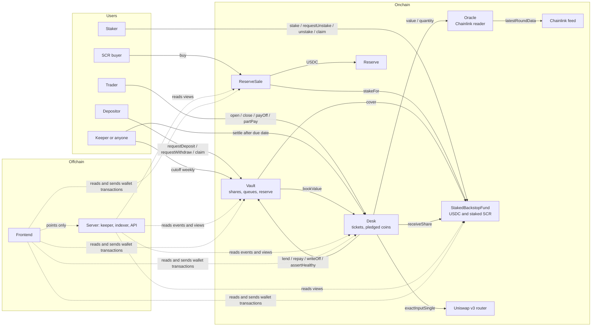
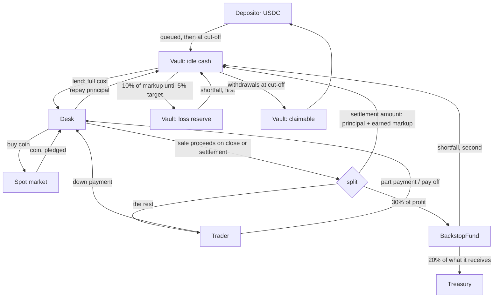
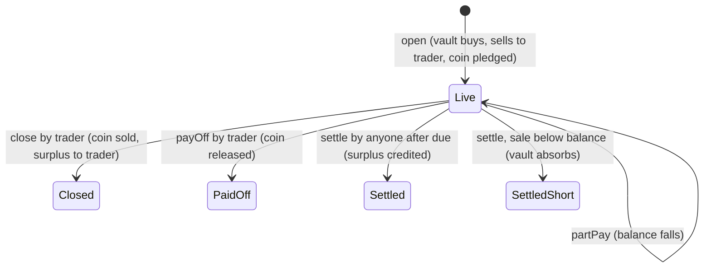

# Sacred: term mode

Halal leverage for traders and real yield for depositors, with no interest anywhere.
This repository holds the first working version: **term mode, end to end**.
It is deployed on Arbitrum One (addresses in [section 3](#deployed-on-arbitrum-one)), but
nothing here is audited or certified by a Shariah board.

| Part | Where | Language | What it does |
| --- | --- | --- | --- |
| Contracts | `contracts/` | Solidity 0.8.26, Foundry | The vault, the ticket desk, the price reader, the backstop fund |
| Server | `server/` | Python, FastAPI, web3.py | A keeper that settles due tickets and runs the weekly cut-off; a read API for the bucket, the fund, the sale and points |
| Frontend | `frontend/` | JavaScript, Next.js, wagmi, viem, Playwright | Four roles in one page: traders open, close, pay off and part pay tickets; depositors deposit, withdraw and claim; stakers stake SCR and claim USDC; SCR buyers buy from the reserve sale. Browser flows for each |
| ABIs and addresses | `abi/`, `deployments/` | JSON | Written by `export_abi.py` and the local deploy script |

## 1. The system in one paragraph

Depositors put USDC into a **Vault** (a mudarabah pool for one coin). A trader opens a
**ticket** at the **Desk**: the vault's USDC buys a real coin on the spot market, the
coin is sold to the trader at cost plus a fixed markup (murabaha), the trader pays a
down payment now and the rest by a due date, and the coin stays pledged in the Desk
(rahn). All markup goes to depositors. If a ticket ends in profit the trader keeps 70%
and 30% goes to the **BackstopFund**, which pays shortfalls after the bucket's own loss
reserve. In term mode nobody but the trader can sell the coin before the due date.

## 2. Architecture

### Contracts and who calls whom (data)



The frontend reads everything it shows from the contracts and sends every transaction
itself, through one data layer (`frontend/app/app/data.js`) that names each read. The server
is a convenience: the frontend asks it for points and nothing else, and hides them when it is
unreachable.

### Where the money goes



### Life of a ticket



### Order in which a loss is absorbed

1. The trader's down payment (it is inside the coin's value).
2. The bucket's loss reserve.
3. The BackstopFund's USDC.
4. The bucket's depositors, through the share price, in proportion.

(With `StakedBackstopFund`, staked SCR is sold after the fund's USDC and before the
depositors. See section 7.)

## 3. Contracts

| Contract | Lines of logic | Built on | Role |
| --- | --- | --- | --- |
| `TicketMath.sol` | ~50 | none | Pure arithmetic: cost, markup, earned markup, settlement amount, payment split, profit share |
| `Oracle.sol` | ~50 | Chainlink interface | Coin/USD price with staleness and L2 sequencer checks; converts coin and USDC |
| `Vault.sol` | ~300 | OpenZeppelin ERC20, Ownable2Step, ReentrancyGuard, SafeERC20 | One bucket: shares, deposit and withdrawal queues, weekly cut-off, loss reserve, lending to the desk |
| `Desk.sol` | ~330 | OpenZeppelin Ownable2Step, ReentrancyGuard, SafeERC20; Uniswap v3 router | Tickets: open, close, pay off, part pay, settle; holds pledged coins |
| `BackstopFund.sol` | ~70 | OpenZeppelin Ownable2Step, SafeERC20 | Receives the profit share, sets aside 20% for the treasury, covers shortfalls for registered vaults |
| `Reserve.sol` | ~110 | OpenZeppelin Ownable2Step, SafeERC20 | Liquidity reserve: holds USDC, deposits into a bucket that is short for its withdrawal queue |
| `StakedBackstopFund.sol` | ~230 | OpenZeppelin Ownable2Step, ReentrancyGuard, SafeERC20; Uniswap v4 | Fund version two: SCR staking with cooldown, 90 day USDC stream to stakers, shortfall cover from USDC then a capped sale of staked SCR |
| `token/SacredTokenDummy.sol` | ~150 | OpenZeppelin ERC20Burnable; Standard Reserve | SCR: 1 billion cap, settles only through the hooked pool |
| `token/TaxHook.sol` | ~260 | Uniswap v4, solady; Standard Reserve | Pool fee in USDC on buys and sells, launch decay, average price, fund exemption |
| `token/SacredMinter.sol` | ~40 | OpenZeppelin Ownable2Step | Only minter: 900 million at genesis, 100 million to the reserve sale |
| `token/LiquidityManager.sol` | ~70 | OpenZeppelin Ownable2Step; Uniswap v4 | Opens the pool and adds the protocol's liquidity; cannot remove it |
| `token/ReserveSale.sol` | ~80 | OpenZeppelin Ownable2Step, ReentrancyGuard | Sells new SCR for USDC to the reserve, delivered staked |
| `token/FeeSplitter.sol` | ~25 | OpenZeppelin SafeERC20 | Pool fee: 20% treasury, then the reserve to its target, then the fund |
| `token/AddressRegistry.sol` | ~40 | OpenZeppelin Ownable2Step; Standard Reserve | Lockable address bindings the token and hook read |
| `mocks/Mocks.sol` | test only | OpenZeppelin ERC20 | Mock token, feed and router |

Production ownership: an OpenZeppelin `TimelockController` (2 day delay) that only a
multisig can propose to and execute from.

Deployment is two scripts, run by one deployer in this order. Both check their inputs
before sending anything (contract code, decimals, a live price feed, the sequencer feed
on Arbitrum One, the Uniswap pool, a contract multisig) and stop if one is wrong.

1. `script/DeployToken.s.sol` deploys the SCR side and the time-lock. It searches for
   the CREATE2 salt that gives the hook an address carrying its Uniswap v4 permission
   bits, and locks the registry bindings that must never change.
2. `script/Deploy.s.sol` deploys one bucket and, given `FUND` and `RESERVE`, wires it to
   the staking fund and the reserve. Run it once per coin.

`contracts/.env.arbitrum.example` lists the Arbitrum One addresses, each checked against
the chain. After both scripts, the deployer opens the SCR pool and adds the protocol's
liquidity, and the multisig accepts ownership of every contract through the time-lock.

### Deployed on Arbitrum One

Every contract below is verified on Arbiscan; each link opens its source.

SCR side

| Contract | Address |
| --- | --- |
| Token (`SacredTokenDummy`, SRD) | [`0x65660a41C634cDD8246c3a6f9816d35D2a29df21`](https://arbiscan.io/address/0x65660a41C634cDD8246c3a6f9816d35D2a29df21#code) |
| Minter (`SacredMinter`) | [`0xdc36Cb2E3be465aC31D06745283cD3420BB52F03`](https://arbiscan.io/address/0xdc36Cb2E3be465aC31D06745283cD3420BB52F03#code) |
| Pool hook (`TaxHook`) | [`0xcE431e351252ba84aFDAFa556887e20524FA2dCD`](https://arbiscan.io/address/0xcE431e351252ba84aFDAFa556887e20524FA2dCD#code) |
| Liquidity manager (`LiquidityManager`) | [`0x42E3735DF423fD006E10A3d97B9C83438d828193`](https://arbiscan.io/address/0x42E3735DF423fD006E10A3d97B9C83438d828193#code) |
| Liquidity reserve (`Reserve`) | [`0xe8d09aB2342b1DfA7BE38b3Af5929D55D054C7b3`](https://arbiscan.io/address/0xe8d09aB2342b1DfA7BE38b3Af5929D55D054C7b3#code) |
| Staking fund (`StakedBackstopFund`) | [`0x29E61dB6f53b4bCA6B9F838b3452c9054d8A446c`](https://arbiscan.io/address/0x29E61dB6f53b4bCA6B9F838b3452c9054d8A446c#code) |
| Fee splitter (`FeeSplitter`) | [`0xCBf479Cd35325d69236c26400ec06B764A38a98a`](https://arbiscan.io/address/0xCBf479Cd35325d69236c26400ec06B764A38a98a#code) |
| Reserve sale (`ReserveSale`) | [`0x158181DCC72FEF6870AA6460b14f826A3A4bA6e5`](https://arbiscan.io/address/0x158181DCC72FEF6870AA6460b14f826A3A4bA6e5#code) |
| Address registry (`AddressRegistry`) | [`0x92c9ce1a970E1CEc443018FB121A3b5015138a96`](https://arbiscan.io/address/0x92c9ce1a970E1CEc443018FB121A3b5015138a96#code) |
| Time-lock (`TimelockController`) | [`0xe408f23305cAc5719880597D36a811854A01d0c9`](https://arbiscan.io/address/0xe408f23305cAc5719880597D36a811854A01d0c9#code) |

BTC bucket (WBTC, 3x max)

| Contract | Address |
| --- | --- |
| Vault | [`0xbbB8891463EB7ac9DF3d81947491A733a1C3a916`](https://arbiscan.io/address/0xbbB8891463EB7ac9DF3d81947491A733a1C3a916#code) |
| Desk | [`0x527ca589937A35504A5535fa1A89a0C8d42c667b`](https://arbiscan.io/address/0x527ca589937A35504A5535fa1A89a0C8d42c667b#code) |
| Oracle | [`0xd49Be92294e17db719625766142655346c60543D`](https://arbiscan.io/address/0xd49Be92294e17db719625766142655346c60543D#code) |

ETH bucket (WETH, 2x max)

| Contract | Address |
| --- | --- |
| Vault | [`0x87e1D4Bc94c932124E856963dE1a7Dc0E3E5Ed37`](https://arbiscan.io/address/0x87e1D4Bc94c932124E856963dE1a7Dc0E3E5Ed37#code) |
| Desk | [`0x054738143B3126D943f97b4572bcDa155A9Af71d`](https://arbiscan.io/address/0x054738143B3126D943f97b4572bcDa155A9Af71d#code) |
| Oracle | [`0xB3D58e5F9D1C862CE88641C52DC43c2693C5f61F`](https://arbiscan.io/address/0xB3D58e5F9D1C862CE88641C52DC43c2693C5f61F#code) |

### The rules the code keeps (and where they are tested)

| Rule | How | Test |
| --- | --- | --- |
| The vault owns the coin before it sells it | `open` lends the full cost and swaps before it records the sale or takes the down payment | `test_open_recordsTheDesignExample` |
| A balance never increases | No function adds to `financed`, `markup`, or subtracts from `repaid` | `invariant_aBalanceNeverIncreases` |
| The vault never receives more than the settlement amount | `_payVault` pays `settlementAmount` on close and pay off, `min(net, balance)` on settlement | `invariant_vaultNeverReceivesMoreThanTheBalance`, `check_settlementNeverExceedsBalance` |
| The trader never owes more than the pledged coin | `settle` never pulls from the trader; a short sale closes the debt | `invariant_settlementNeverChargesTheTrader`, `test_settle_short_...` |
| Only the trader can sell before the due date | `settle` reverts until `block.timestamp > due`; there is no other sale path | `test_noOneCanSellBeforeDueExceptTheTrader` |
| A pledged coin leaves only to its owner or the market | `payOff` and `_swap` are the only coin transfers | `invariant_deskHoldsOnlyPledgesAndOwedSurpluses` |
| Exits cannot be paused | Only `open` and `requestDeposit` check a pause flag; the guardian can pause but not unpause | `test_pause_blocksOpeningOnly`, `test_deposit_pausedByGuardian_withdrawalsStillWork` |
| Shares cannot be transferred | `transfer`, `transferFrom`, `approve` always revert | `test_shares_cannotBeTransferredOrApproved` |
| Every USDC in the vault is counted exactly once | Four counters; the vault never reads its own balance | `invariant_vaultIsFullyBacked`, `test_sharePrice_ignoresDonations` |
| The admin cannot leave coded limits or touch live tickets | Bounds in every setter; ticket terms are stored at opening | `test_admin_cannotExceedHardLimits`, `test_paramChangeDoesNotTouchLiveTicket` |

## 4. Design choices and why

- **Two contracts per bucket, not one and not many.** The Vault knows nothing about
  coins or prices; the Desk knows nothing about shares. Each can be read in one sitting.
  A contract per ticket would separate coins physically but adds deployment cost and
  code; see the assumption on custody in section 6.
- **Immutable, no proxies.** A live ticket's rules must not change under it. New
  behaviour ships as a new bucket. The admin can only tune parameters for future
  tickets, inside limits written into the code.
- **Internal accounting only.** The Vault tracks `idle`, `queuedDeposits`, `reserve`
  and `claimable` itself and never reads `balanceOf(this)`. Donations cannot move the
  share price, which removes the usual vault inflation attacks.
- **Epoch queues instead of ERC-4626.** Shares are priced once a week, so instant
  `deposit`/`redeem` cannot exist. Requests are recorded per epoch and settled lazily on
  claim, which keeps the cut-off cheap regardless of how many depositors there are.
- **Share price uses the price feed, sales use the market.** The feed values live
  tickets at the cut-off and floors every sale the protocol triggers. It never decides
  whether a term ticket is sold.
- **The feed floors purchases too.** Without it a trader could move the pool, make the
  vault overpay, and abandon the ticket. With it the vault can be off by at most the
  tolerance (1%), which lands on the trader's own down payment first.
- **Pull payments where a push could block others.** Settlement surpluses are credited
  and claimed; the treasury's cut is accrued and claimed. A blocked USDC recipient can
  therefore never block a settlement or a close.
- **A failing backstop cannot block a settlement.** The Vault calls the fund inside
  `try/catch` and counts only what actually arrived.
- **Principal first.** Every payment to the vault is applied to principal, then to
  markup. The loss reserve takes its slice from markup only.
- **The keeper has no rights.** `settle` and `cutoff` are open to anyone. The server is
  a convenience; every exit works with it switched off.
- **Gas.** Storage is written plainly for readability. The one unbounded-looking loop,
  `bookValue`, is capped by `maxLive` (at most 500). On an L2 this is cheap; on Ethereum
  mainnet a cut-off with 200 live tickets would cost roughly 3 million gas.
- **Existing code.** OpenZeppelin v5.1 for tokens, ownership, reentrancy and the
  time-lock; Uniswap v3's router for swaps; Chainlink for prices. Nothing is forked or
  modified.

## 5. Tests

| Suite | Tool | What it covers | Result on this machine |
| --- | --- | --- | --- |
| `Desk.t.sol`, `Vault.t.sol` | Foundry unit + fuzz (1,000 runs each) | Every function, every revert, the design's worked examples, a fuzzed full ticket lifecycle | 68 passed |
| `TicketMath.t.sol` | Foundry fuzz | Bounds and monotonicity of the arithmetic | 4 passed |
| `Invariant.t.sol` | Foundry invariant (64 runs x 120 calls) | Nine system invariants under random deposits, withdrawals, cut-offs, tickets, prices and time | 9 passed |
| `TaxHook.t.sol` | Foundry unit + fuzz, real Uniswap v4 `PoolManager` | The pool fee for all four swap shapes, launch decay, liquidity rules, the venue gate; run with USDC as currency0 and as currency1 | 46 passed |
| `SacredSystem.t.sol` | Foundry unit + fuzz + integration | Minter, liquidity manager, fee splitter, reserve, reserve sale and staking fund, wired together with the real `Vault`; both currency orders | 138 passed |
| `DeployToken.t.sol` | Foundry | The SCR deploy script: mined hook address, wiring, ownership hand-over, a trade on the deployed pool | 5 passed |
| `ArbitrumFork.t.sol` | Foundry fork of Arbitrum One | Both deploy scripts as run; a 3x BTC ticket opened and closed on the real Uniswap v3 pool at the real Chainlink price; the SCR pool, reserve sale and a shortfall sale on the real Uniswap v4 `PoolManager` | 5 passed (2026-10-04, public RPC) |
| `DeployLocal.t.sol` | Foundry | The local deployment script: the whole system on one chain, wired, with the pool open | 4 passed |
| `TicketMath.t.sol` `check_*` | Halmos symbolic execution | Eight properties of the arithmetic for all inputs in stated ranges | **2 proved, 6 not proved** (solver timed out at 180 s each, twice) |
| `server/tests` | pytest | Keeper logic, points, indexer, API, and one end to end run against anvil: deposit, cut-off, a ticket settled by the keeper, a profitable close feeding the fund, a stake, a reserve sale | 18 passed |
| `frontend/lib/*.test.js` | vitest | The frontend's ticket, staking and sale arithmetic matches the contracts to the unit | 20 passed |
| `frontend/e2e/` | Playwright, headless Chromium | The four user flows through the real page against anvil, with the real keeper settling and the real API serving points: a depositor in and out across two cut-offs; a trader opening, part-paying, closing in profit, paying off, and being settled by the keeper; a staker earning and leaving after the cooldown; an SCR buyer paying the reserve and receiving a stake | 4 passed, twice in a row |

What was **not** done:

- **Symbolic execution mostly did not finish.** Halmos proved `check_splitConserves` and
  `check_profitShareBounded`. The other six checks (earned markup bounds and
  monotonicity, settlement never above the balance, the 70% floor, cost bounds) multiply
  and divide symbolic values, and the Yices solver timed out on each, even after the
  checks were narrowed to the 7 and 14 day terms. Bitwuzla was not installed. Those six
  properties are covered by fuzz tests only, which sample and do not prove.
- **No Certora or other full formal verification.** Halmos targets the pure arithmetic
  only. The stateful contracts are covered by fuzzing and invariants,
  which sample behaviour and do not prove it.
- **The fork test is opt-in.** `ArbitrumFork.t.sol` runs both deploy scripts against a
  fork of Arbitrum One and is skipped unless `ARBITRUM_RPC_URL` is set. Every other
  suite mocks swaps and feeds. The fork test covers the WBTC bucket only, at the
  chain's state on the day it is run.
- **No real wallet extension.** The browser flows install a small EIP-1193 provider on
  `window.ethereum` (`frontend/e2e/wallet.mjs`) that answers the account and chain questions
  itself, estimates gas with headroom as a wallet would, and forwards everything else to
  anvil, which signs for its unlocked accounts. The app's injected-wallet path is the real
  one; only the signing is stubbed. MetaMask itself was not driven.
- **No audit.**

Run everything:

```sh
# contracts (needs Foundry; libraries are not committed)
cd contracts
git clone --depth 1 --branch v5.1.0 https://github.com/OpenZeppelin/openzeppelin-contracts lib/openzeppelin-contracts
git clone --depth 1 https://github.com/foundry-rs/forge-std lib/forge-std
git clone --depth 1 --branch v4.0.0 https://github.com/Uniswap/v4-core lib/v4-core
git clone --depth 1 https://github.com/Vectorized/solady lib/solady
git clone --depth 1 https://github.com/transmissions11/solmate lib/solmate   # v4-core PoolManager, tests only
forge test
ARBITRUM_RPC_URL=https://arb1.arbitrum.io/rpc forge test --match-contract ArbitrumFork   # optional
halmos --contract TicketMathTest --function check_ --solver-timeout-assertion 180000

# server
cd ../server && uv venv --python 3.12 .venv && uv pip install --python .venv/bin/python -r requirements.txt
.venv/bin/python -m pytest

# frontend
cd ../frontend && npm install && npx playwright install chromium
npm test && npm run build
npm run test:e2e        # boots anvil, deploys, starts the keeper, the API and Next, drives the page
```

Run it locally:

```sh
anvil                                             # terminal 1
cd contracts && forge script script/DeployLocal.s.sol --rpc-url http://127.0.0.1:8545 --broadcast
cd .. && python3 export_abi.py                    # copies ABIs and local addresses
cd server && KEEPER_KEY=<anvil key> .venv/bin/python -m destiny.keeper          # terminal 2
cd server && .venv/bin/uvicorn --factory destiny.api:app_from_env               # terminal 3
cd frontend && npm run dev                        # terminal 4
```

The local deployment is the whole system: mocks for USDC, WBTC, the feed and the spot
market, a real Uniswap v4 `PoolManager`, the SCR side with the pool open, and a BTC term
bucket on the staking fund and the reserve. The deployer (anvil's first account, fixed in the
script so a `.env` written for a live chain can never leak in) is admin, manager, treasury,
guardian, distributor and reserve operator, holds 1,000,000 USDC and the genesis SCR, and
must deposit into the bucket before anyone else can: the manager has to hold at least 5% of
it. The app connects to any injected wallet on chain 31337; point it at the node with
`NEXT_PUBLIC_RPC_URL` if it is not on port 8545.

## 6. Assumptions

1. **1 USDC = 1 USD.** The Oracle reads a coin/USD feed and treats it as coin/USDC.
2. **Tokens behave.** USDC and the coin are plain ERC-20s: no fee on transfer, no
   rebasing, no callbacks.
3. **Bookkeeping separation is enough.** Pledged coins of all tickets sit in one Desk
   contract and are separated per ticket by recorded quantity. A Shariah board may want
   one contract per ticket; that would be a new Desk, not a change to this one.
4. **One transaction counts as possession.** The vault buys and resells within one
   transaction (ruling 4 in the design document).
5. **The admin multisig and time-lock are honest and awake.** They can change rates,
   caps, the oracle address and the fund address for future business.
6. **Someone runs the keeper.** If nobody settles a ticket after its due date, the
   vault keeps carrying its price risk.
7. **Guarded launch.** Depositors and traders are allow-listed, the bucket is capped,
   and at most `maxLive` tickets are live.
8. **The spot pool is deep enough** that a ticket-sized sale lands within 1% of the
   feed. Otherwise opens and settlements revert until it does.

## 7. What differs from the design document

- **The SCR side is built and deploys with the buckets, but nothing is live.** The
  token, minter, pool hook, liquidity manager, reserve, reserve sale, fee splitter and
  the staking fund (`StakedBackstopFund`) are tested together against a real Uniswap v4
  `PoolManager` and the real `Vault`. The bucket deploy script wires a bucket to the
  staking fund and the reserve when it is given them, and the local deploy script
  deploys the whole system that way. The `Desk` unit tests still use version one of the
  fund (`BackstopFund`), which holds USDC only.
- **The token and hook are adapted from Standard Reserve's verified contracts** on
  Robinhood Chain (MIT). The token is theirs with names changed, so it still carries a
  launch wallet cap of 1.2 million SCR that the design does not mention. The hook is
  re-denominated from ETH to USDC and trimmed.
- **The launch fee starts above the design's 1% and 3%** and decays to them. The
  ceiling on a manually set fee is 5%, as designed.
- **The token deploys under a placeholder name.** On chain it is `SacredTokenDummy`
  with the ticker `SRD`. This document and the code comments still call it SCR.
- **The reserve deposits only when a bucket is short for its withdrawal queue.** The
  design also says "or the bucket is full", which the vault's cap would reject.
- **A shortfall sale of staked SCR stops 10% below the pool's average price** (the
  design leaves the price-impact limit open) and is capped at 30% of the stake.
- **Leaving the stake is a 14 day cooldown followed by a 7 day window.** Shares in
  cooldown still earn and can still be sold for a shortfall. The window is not in the
  design; without it a staker could sit permanently ready to leave.
- **No protocol-owned stake, no airdrop, no staker votes on the dials.** The time-lock
  sets every parameter.
- **No staker discount on the profit share.** It is a flat 30%.
- **Unfilled withdrawals are returned, not carried over.** When cash is short, every
  request is paid in the same proportion and the unredeemed shares go back to the
  depositor on claim. They must be requested again for the next cut-off.
- **The reserve slice is taken as markup arrives**, not from the rise of the share
  price above its previous high. The manager takes no share, so no high-water mark is
  needed.
- **No utilisation add-on in the rate.** The curve was never set.
- **No fallback auction** when a settlement sale cannot meet the price floor. It
  reverts and is retried.
- **Opening needs idle cash equal to the full cost**, not just the financed amount,
  because the vault really does buy the coin before the down payment arrives.

## 8. Security risks

### Known

| Risk | What could happen | What limits it |
| --- | --- | --- |
| Term mode carries crashes | A fall larger than the down payment within the term is the bucket's loss. Backtest: 1.0% a year on average and 5.1% in the worst year for 14 day BTC 3x | Leverage ceilings fixed in code, loss reserve, backstop fund |
| Stale or wrong price feed | Cut-off, settlement and opening revert while it is stale, so withdrawals wait. A wrong price misprices shares for that cut-off | Staleness and sequencer checks; the time-lock can point the Desk at a new Oracle |
| Feed down at pay off | The trader can still pay off, and the profit share for that ticket is zero | Chosen on purpose: exits come first |
| Unrealised losses between cut-offs | A depositor who sees a crash can queue a withdrawal, but it is priced at the cut-off with tickets marked to the feed, so the loss is shared | Weekly mark-to-feed of every live ticket |
| Thin market at settlement | The sale reverts below the floor and the ticket stays live, still exposed | Retry; ticket size cap; no auction fallback yet |
| Sandwiching | Up to the 1% tolerance on protocol-triggered sales and on opens | Feed floor; trader's own limit on open and close |
| Keeper fee in a shortfall | The fee (at most 20 USDC, default 1) is paid before the vault, slightly deepening a shortfall | Hard cap in code |
| Live-list flooding | An allow-listed trader could fill `maxLive` with small tickets and block new ones | Minimum down payment; allow-list; markup is charged on each |
| USDC freeze | A frozen Vault or Desk address stops everything | None inside this design |
| Wrapped BTC | The wrapper fails or loses its peg | Choice of wrapper; bucket cap |
| Admin keys | A captured multisig could, after two days, swap in a lying oracle or a hostile fund for future operations, or halt new business | Time-lock delay; hard limits; no function moves a pledged coin or a depositor's cash |
| Fund address change | `setFund` on the Desk redirects future profit shares | Time-lock |
| Rounding dust | Division rounds down; dust shares can be left in the Vault | Rounds against the claimant; covered by invariants |
| Server | The API is unauthenticated and read-only; the keeper key holds only gas money | No user funds or rights off-chain |

### Unknown or untested

- Behaviour against the **real** Uniswap v3 router and Chainlink feeds on Arbitrum.
- Gas use and limits with hundreds of live tickets on a real chain.
- Interaction of many buckets sharing one BackstopFund.
- Economic attacks that combine deposit timing, cut-off timing and price moves. The
  invariant suite samples these but proves nothing.
- Anything a professional audit would find. This code has had none.
- Whether a Shariah board accepts the structure as built. Fifteen rulings are open.

## 9. Layout

```
sacred/
  contracts/   src/ (Vault, Desk, Oracle, BackstopFund, StakedBackstopFund, Reserve,
               TicketMath, token/, mocks), test/, script/
  server/      destiny/ (chain, keeper, indexer, points, api), tests/
  frontend/    app/ (landing page; app/ with data.js and one panel per role: OrderForm,
               Tickets, Earn, Stake, Sale), lib/ (math, scr, errors, api, contracts),
               e2e/ (harness, test wallet, one flow per role), abi/
  abi/         contract ABIs for the server
  deployments/ local.json, written by the local deploy script
  export_abi.py
```

## 10. Next steps

- **Stablecoin vaults on Robinhood Chain.** Version one, with the token, deploys on
  Arbitrum One. Buckets on Robinhood Chain come next, taking USDG deposits. The token,
  its pool, the reserve and the staking fund stay on Arbitrum One, because the token
  settles through one hooked pool. A bucket on another chain cannot call the staking
  fund in the same transaction, so it starts with the USDC-only `BackstopFund` and its
  own loss reserve. Cover across chains needs a messaging layer and is not designed.
- **Staker discount on the profit share.** The design lets a trader who has staked at
  least a set amount of SCR pay less than the 30% profit share. It exists to give
  traders a reason to hold SCR. Both numbers are unset in the design. It is left out
  of version one: it cuts the fund's income, needs a `Desk` change, and adds a ruling
  for the board.
- **Staker voting.** The design has stakers set the risk dials (rates, caps, leverage,
  new buckets) inside the board's ceilings. The reason is the founder's Shariah
  position that stakers are loss-bearing partners, not paid guarantors, and a say over
  the risk they underwrite supports that. It is not needed to launch. The multisig and
  time-lock already set those dials inside ceilings fixed in code, and voting lets
  anyone who buys enough SCR vote for more risk. It is deferred until the board rules
  on the stakers' reward.
