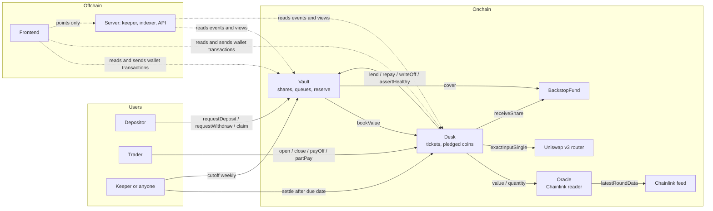
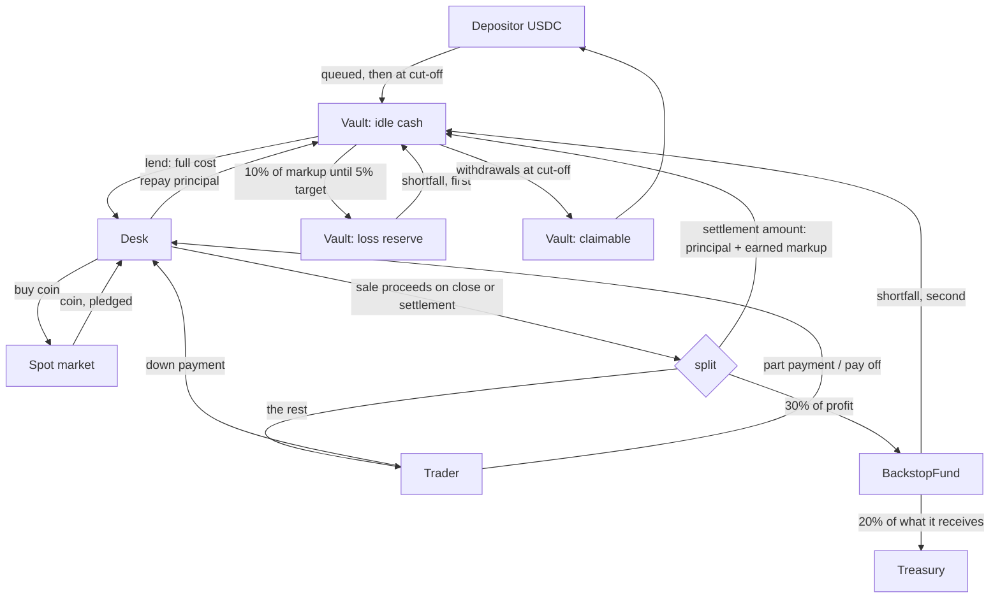
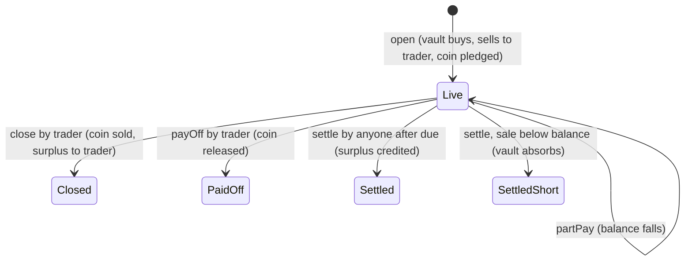

# Destiny: term mode

Halal leverage for traders and real yield for depositors, with no interest anywhere.
This repository holds the first working version: **term mode, end to end**.
Nothing here is deployed, audited, or certified by a Shariah board.

| Part | Where | Language | What it does |
| --- | --- | --- | --- |
| Contracts | `contracts/` | Solidity 0.8.26, Foundry | The vault, the ticket desk, the price reader, the backstop fund |
| Server | `server/` | Python, FastAPI, web3.py | A keeper that settles due tickets and runs the weekly cut-off; a read API; points |
| Frontend | `frontend/` | JavaScript, Next.js, wagmi, viem | Open, close, pay off and part pay tickets; deposit, withdraw and claim |
| ABIs and addresses | `abi/`, `deployments/` | JSON | Written by `export_abi.py` and the local deploy script |

## 1. The system in one paragraph

Depositors put USDC into a **Vault** (a mudarabah pool for one coin). A trader opens a
**ticket** at the **Desk**: the vault's USDC buys a real coin on the spot market, the
coin is sold to the trader at cost plus a fixed markup (murabaha), the trader pays a
down payment now and the rest by a due date, and the coin stays pledged in the Desk
(rahn). All markup goes to depositors. If a ticket ends in profit the trader keeps 70%
and 30% goes to the **BackstopFund**, which pays shortfalls after the bucket's own loss
reserve. In term mode nobody but the trader can sell the coin before the due date.

## 2. Architecture

### Contracts and who calls whom (data)



### Where the money goes



### Life of a ticket



### Order in which a loss is absorbed

1. The trader's down payment (it is inside the coin's value).
2. The bucket's loss reserve.
3. The BackstopFund's USDC.
4. The bucket's depositors, through the share price, in proportion.

(The design's "staked DES" layer is not in this version. See section 7.)

## 3. Contracts

| Contract | Lines of logic | Built on | Role |
| --- | --- | --- | --- |
| `TicketMath.sol` | ~50 | none | Pure arithmetic: cost, markup, earned markup, settlement amount, payment split, profit share |
| `Oracle.sol` | ~50 | Chainlink interface | Coin/USD price with staleness and L2 sequencer checks; converts coin and USDC |
| `Vault.sol` | ~300 | OpenZeppelin ERC20, Ownable2Step, ReentrancyGuard, SafeERC20 | One bucket: shares, deposit and withdrawal queues, weekly cut-off, loss reserve, lending to the desk |
| `Desk.sol` | ~330 | OpenZeppelin Ownable2Step, ReentrancyGuard, SafeERC20; Uniswap v3 router | Tickets: open, close, pay off, part pay, settle; holds pledged coins |
| `BackstopFund.sol` | ~70 | OpenZeppelin Ownable2Step, SafeERC20 | Receives the profit share, sets aside 20% for the treasury, covers shortfalls for registered vaults |
| `mocks/Mocks.sol` | test only | OpenZeppelin ERC20 | Mock token, feed and router |

Production ownership: an OpenZeppelin `TimelockController` (2 day delay) that only a
multisig can propose to and execute from (`script/Deploy.s.sol`).

### The rules the code keeps (and where they are tested)

| Rule | How | Test |
| --- | --- | --- |
| The vault owns the coin before it sells it | `open` lends the full cost and swaps before it records the sale or takes the down payment | `test_open_recordsTheDesignExample` |
| A balance never increases | No function adds to `financed`, `markup`, or subtracts from `repaid` | `invariant_aBalanceNeverIncreases` |
| The vault never receives more than the settlement amount | `_payVault` pays `settlementAmount` on close and pay off, `min(net, balance)` on settlement | `invariant_vaultNeverReceivesMoreThanTheBalance`, `check_settlementNeverExceedsBalance` |
| The trader never owes more than the pledged coin | `settle` never pulls from the trader; a short sale closes the debt | `invariant_settlementNeverChargesTheTrader`, `test_settle_short_...` |
| Only the trader can sell before the due date | `settle` reverts until `block.timestamp > due`; there is no other sale path | `test_noOneCanSellBeforeDueExceptTheTrader` |
| A pledged coin leaves only to its owner or the market | `payOff` and `_swap` are the only coin transfers | `invariant_deskHoldsOnlyPledgesAndOwedSurpluses` |
| Exits cannot be paused | Only `open` and `requestDeposit` check a pause flag; the guardian can pause but not unpause | `test_pause_blocksOpeningOnly`, `test_deposit_pausedByGuardian_withdrawalsStillWork` |
| Shares cannot be transferred | `transfer`, `transferFrom`, `approve` always revert | `test_shares_cannotBeTransferredOrApproved` |
| Every USDC in the vault is counted exactly once | Four counters; the vault never reads its own balance | `invariant_vaultIsFullyBacked`, `test_sharePrice_ignoresDonations` |
| The admin cannot leave coded limits or touch live tickets | Bounds in every setter; ticket terms are stored at opening | `test_admin_cannotExceedHardLimits`, `test_paramChangeDoesNotTouchLiveTicket` |

## 4. Design choices and why

- **Two contracts per bucket, not one and not many.** The Vault knows nothing about
  coins or prices; the Desk knows nothing about shares. Each can be read in one sitting.
  A contract per ticket would separate coins physically but adds deployment cost and
  code; see the assumption on custody in section 6.
- **Immutable, no proxies.** A live ticket's rules must not change under it. New
  behaviour ships as a new bucket. The admin can only tune parameters for future
  tickets, inside limits written into the code.
- **Internal accounting only.** The Vault tracks `idle`, `queuedDeposits`, `reserve`
  and `claimable` itself and never reads `balanceOf(this)`. Donations cannot move the
  share price, which removes the usual vault inflation attacks.
- **Epoch queues instead of ERC-4626.** Shares are priced once a week, so instant
  `deposit`/`redeem` cannot exist. Requests are recorded per epoch and settled lazily on
  claim, which keeps the cut-off cheap regardless of how many depositors there are.
- **Share price uses the price feed, sales use the market.** The feed values live
  tickets at the cut-off and floors every sale the protocol triggers. It never decides
  whether a term ticket is sold.
- **The feed floors purchases too.** Without it a trader could move the pool, make the
  vault overpay, and abandon the ticket. With it the vault can be off by at most the
  tolerance (1%), which lands on the trader's own down payment first.
- **Pull payments where a push could block others.** Settlement surpluses are credited
  and claimed; the treasury's cut is accrued and claimed. A blocked USDC recipient can
  therefore never block a settlement or a close.
- **A failing backstop cannot block a settlement.** The Vault calls the fund inside
  `try/catch` and counts only what actually arrived.
- **Principal first.** Every payment to the vault is applied to principal, then to
  markup. The loss reserve takes its slice from markup only.
- **The keeper has no rights.** `settle` and `cutoff` are open to anyone. The server is
  a convenience; every exit works with it switched off.
- **Gas.** Storage is written plainly for readability. The one unbounded-looking loop,
  `bookValue`, is capped by `maxLive` (at most 500). On an L2 this is cheap; on Ethereum
  mainnet a cut-off with 200 live tickets would cost roughly 3 million gas.
- **Existing code.** OpenZeppelin v5.1 for tokens, ownership, reentrancy and the
  time-lock; Uniswap v3's router for swaps; Chainlink for prices. Nothing is forked or
  modified.

## 5. Tests

| Suite | Tool | What it covers | Result on this machine |
| --- | --- | --- | --- |
| `Desk.t.sol`, `Vault.t.sol` | Foundry unit + fuzz (1,000 runs each) | Every function, every revert, the design's worked examples, a fuzzed full ticket lifecycle | 68 passed |
| `TicketMath.t.sol` | Foundry fuzz | Bounds and monotonicity of the arithmetic | 4 passed |
| `Invariant.t.sol` | Foundry invariant (64 runs x 120 calls) | Nine system invariants under random deposits, withdrawals, cut-offs, tickets, prices and time | 9 passed |
| `TicketMath.t.sol` `check_*` | Halmos symbolic execution | Eight properties of the arithmetic for all inputs in stated ranges | **2 proved, 6 not proved** (solver timed out at 180 s each, twice) |
| `server/tests` | pytest | Keeper logic, points, indexer, API, and one end to end run against anvil | 16 passed |
| `frontend/lib/math.test.js` | vitest | The frontend's arithmetic matches the contract to the unit | 11 passed |

What was **not** done:

- **Symbolic execution mostly did not finish.** Halmos proved `check_splitConserves` and
  `check_profitShareBounded`. The other six checks (earned markup bounds and
  monotonicity, settlement never above the balance, the 70% floor, cost bounds) multiply
  and divide symbolic values, and the Yices solver timed out on each, even after the
  checks were narrowed to the 7 and 14 day terms. Bitwuzla was not installed. Those six
  properties are covered by fuzz tests only, which sample and do not prove.
- **No Certora or other full formal verification.** Halmos targets the pure arithmetic
  only. The stateful contracts are covered by fuzzing and invariants,
  which sample behaviour and do not prove it.
- **No fork test** against real Uniswap and Chainlink on Arbitrum. Swaps and feeds are
  mocked.
- **The frontend was built and its arithmetic tested, but it was not driven in a
  browser with a wallet.**
- **No audit.**

Run everything:

```sh
# contracts (needs Foundry; libraries are not committed)
cd contracts
git clone --depth 1 --branch v5.1.0 https://github.com/OpenZeppelin/openzeppelin-contracts lib/openzeppelin-contracts
git clone --depth 1 https://github.com/foundry-rs/forge-std lib/forge-std
forge test
halmos --contract TicketMathTest --function check_ --solver-timeout-assertion 180000

# server
cd ../server && uv venv --python 3.12 .venv && uv pip install --python .venv/bin/python -r requirements.txt
.venv/bin/python -m pytest

# frontend
cd ../frontend && npm install && npm test && npm run build
```

Run it locally:

```sh
anvil                                             # terminal 1
cd contracts && forge script script/DeployLocal.s.sol --rpc-url http://127.0.0.1:8545 --broadcast
cd .. && python3 export_abi.py                    # copies ABIs and local addresses
cd server && KEEPER_KEY=<anvil key> .venv/bin/python -m destiny.keeper          # terminal 2
cd server && .venv/bin/uvicorn --factory destiny.api:app_from_env               # terminal 3
cd frontend && npm run dev                        # terminal 4
```

## 6. Assumptions

1. **1 USDC = 1 USD.** The Oracle reads a coin/USD feed and treats it as coin/USDC.
2. **Tokens behave.** USDC and the coin are plain ERC-20s: no fee on transfer, no
   rebasing, no callbacks.
3. **Bookkeeping separation is enough.** Pledged coins of all tickets sit in one Desk
   contract and are separated per ticket by recorded quantity. A Shariah board may want
   one contract per ticket; that would be a new Desk, not a change to this one.
4. **One transaction counts as possession.** The vault buys and resells within one
   transaction (ruling 4 in the design document).
5. **The admin multisig and time-lock are honest and awake.** They can change rates,
   caps, the oracle address and the fund address for future business.
6. **Someone runs the keeper.** If nobody settles a ticket after its due date, the
   vault keeps carrying its price risk.
7. **Guarded launch.** Depositors and traders are allow-listed, the bucket is capped,
   and at most `maxLive` tickets are live.
8. **The spot pool is deep enough** that a ticket-sized sale lands within 1% of the
   feed. Otherwise opens and settlements revert until it does.

## 7. What differs from the design document

- **No DES, staking, reserve sales or pool hook.** The BackstopFund here holds USDC
  only. Of what it receives, 20% is set aside for the treasury and 80% stays as
  shortfall cover with no other way out. The staker stream and the liquidity reserve's
  15% need the next fund version.
- **No staker discount on the profit share.** It is a flat 30%.
- **Unfilled withdrawals are returned, not carried over.** When cash is short, every
  request is paid in the same proportion and the unredeemed shares go back to the
  depositor on claim. They must be requested again for the next cut-off.
- **The reserve slice is taken as markup arrives**, not from the rise of the share
  price above its previous high. The manager takes no share, so no high-water mark is
  needed.
- **No utilisation add-on in the rate.** The curve was never set.
- **No fallback auction** when a settlement sale cannot meet the price floor. It
  reverts and is retried.
- **Opening needs idle cash equal to the full cost**, not just the financed amount,
  because the vault really does buy the coin before the down payment arrives.

## 8. Security risks

### Known

| Risk | What could happen | What limits it |
| --- | --- | --- |
| Term mode carries crashes | A fall larger than the down payment within the term is the bucket's loss. Backtest: 1.0% a year on average and 5.1% in the worst year for 14 day BTC 3x | Leverage ceilings fixed in code, loss reserve, backstop fund |
| Stale or wrong price feed | Cut-off, settlement and opening revert while it is stale, so withdrawals wait. A wrong price misprices shares for that cut-off | Staleness and sequencer checks; the time-lock can point the Desk at a new Oracle |
| Feed down at pay off | The trader can still pay off, and the profit share for that ticket is zero | Chosen on purpose: exits come first |
| Unrealised losses between cut-offs | A depositor who sees a crash can queue a withdrawal, but it is priced at the cut-off with tickets marked to the feed, so the loss is shared | Weekly mark-to-feed of every live ticket |
| Thin market at settlement | The sale reverts below the floor and the ticket stays live, still exposed | Retry; ticket size cap; no auction fallback yet |
| Sandwiching | Up to the 1% tolerance on protocol-triggered sales and on opens | Feed floor; trader's own limit on open and close |
| Keeper fee in a shortfall | The fee (at most 20 USDC, default 1) is paid before the vault, slightly deepening a shortfall | Hard cap in code |
| Live-list flooding | An allow-listed trader could fill `maxLive` with small tickets and block new ones | Minimum down payment; allow-list; markup is charged on each |
| USDC freeze | A frozen Vault or Desk address stops everything | None inside this design |
| Wrapped BTC | The wrapper fails or loses its peg | Choice of wrapper; bucket cap |
| Admin keys | A captured multisig could, after two days, swap in a lying oracle or a hostile fund for future operations, or halt new business | Time-lock delay; hard limits; no function moves a pledged coin or a depositor's cash |
| Fund address change | `setFund` on the Desk redirects future profit shares | Time-lock |
| Rounding dust | Division rounds down; dust shares can be left in the Vault | Rounds against the claimant; covered by invariants |
| Server | The API is unauthenticated and read-only; the keeper key holds only gas money | No user funds or rights off-chain |

### Unknown or untested

- Behaviour against the **real** Uniswap v3 router and Chainlink feeds on Arbitrum.
- Gas use and limits with hundreds of live tickets on a real chain.
- Interaction of many buckets sharing one BackstopFund.
- Economic attacks that combine deposit timing, cut-off timing and price moves. The
  invariant suite samples these but proves nothing.
- Anything a professional audit would find. This code has had none.
- Whether a Shariah board accepts the structure as built. Fifteen rulings are open.

## 9. Layout

```
sacred/
  contracts/   src/ (Vault, Desk, Oracle, BackstopFund, TicketMath, mocks), test/, script/
  server/      destiny/ (chain, keeper, indexer, points, api), tests/
  frontend/    app/ (page, providers), lib/ (math, contracts), abi/
  abi/         contract ABIs for the server
  deployments/ local.json, written by the local deploy script
  export_abi.py
```
